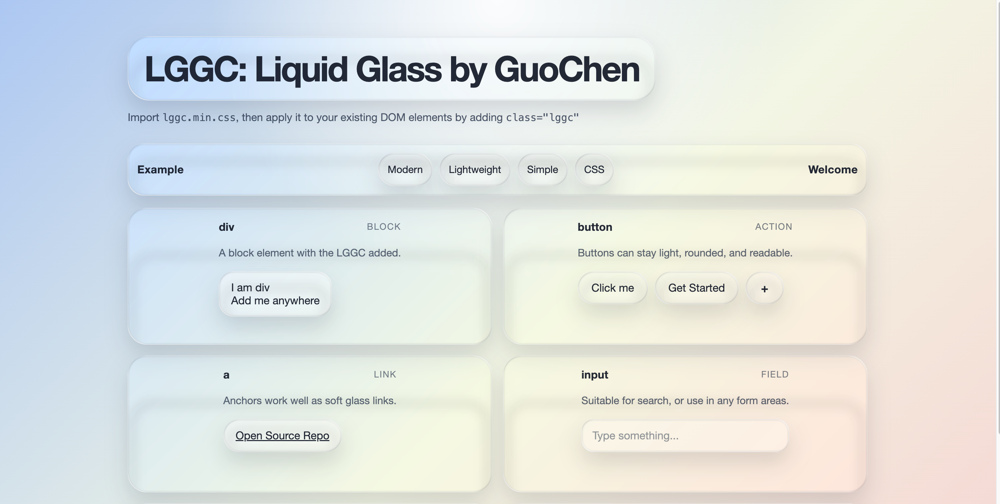
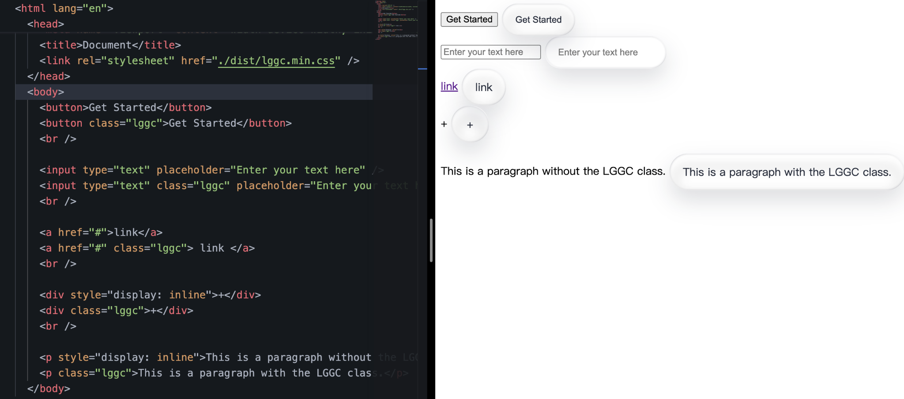

# LGGC: Liquid Glass by GuoChen

[](https://github.com/u7663394)
[-black?logo=github)](https://github.com/u7663394)
[](mailto:guochenwang710@gmail.com)

<p align="right">
  🌐 Language: <a href="./README.md">English</a> | Chinese
</p>

https://github.com/user-attachments/assets/b3110481-47c6-414f-a1dc-8e12a1b62483

> 只需添加一个类 `class="lggc"`，即可将 DOM 元素变为液态玻璃 UI

## 1. 🚀 安装

### 本地 / 直接使用

```html
<link rel="stylesheet" href="./dist/lggc.css" /> 
 <!-- 或者  -->
<link rel="stylesheet" href="./dist/lggc.min.css" />
```

### CDN

```html
<link rel="stylesheet" href="https://cdn.jsdelivr.net/npm/@guochenwang/lggc@0.1.0/dist/lggc.css" />
<!-- 或者 -->
<link rel="stylesheet" href="https://cdn.jsdelivr.net/npm/@guochenwang/lggc@0.1.0/dist/lggc.min.css" />
```

### NPM

```bash
npm install @guochenwang/lggc
```
然后你可以在 `./node_modules/@guochenwang/lggc/dist/lggc.min.css` 中找到 CSS 文件。
```bash
import '@guochenwang/lggc/dist/lggc.min.css'
```

## 2. 🚀 用法

### CSS

```html
<div class="lggc">Hello Liquid Glass</div>
```

### 或者你想进一步微调

以下变量是公开接口：

- `--lggc-radius`
- `--lggc-padding`
- `--lggc-bg`
- `--lggc-border`
- `--lggc-blur`
- `--lggc-highlight`

示例：

```html
<div
  class="lggc"
  style="
    --lggc-radius: 28px;
    --lggc-padding: 1.25rem 1.5rem;
    --lggc-bg: rgba(255,255,255,0.18);">
  Customized glass
</div>
```

## 3. 演示

打开 [官网/欢迎页面](https://u7663394.github.io/LGGC-liquid-glass/) 预览效果。





## 4. 特性

- 液态玻璃视觉效果
- 只需单个类即可使用，即 class="lggc"
- 纯 CSS 且开源
- 超轻量

## 5. 灵感来源

本作品的灵感来自 [Bilibili 上的一条视频](https://www.bilibili.com/video/BV1J8QSBqEpy/?spm_id_from=333.337.search-card.all.click). 特别感谢 [视频 up 主](https://space.bilibili.com/91370417?spm_id_from=333.788.upinfo.detail.click) 分享了如此有启发性的内容与创意。
